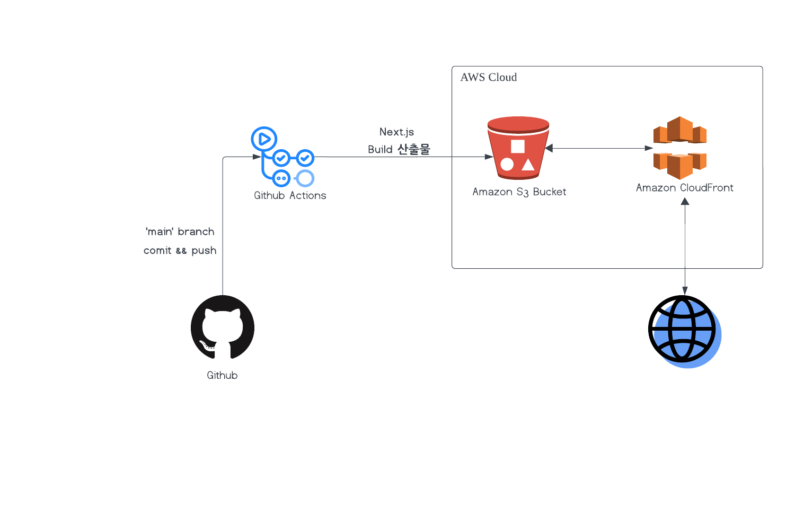

# CI/CD 심화 과제

## 주요 링크

- **S3 버킷 웹사이트 엔드포인트**: [http://hanghae-jieun-bucket.s3-website.ap-northeast-2.amazonaws.com](http://hanghae-jieun-bucket.s3-website.ap-northeast-2.amazonaws.com)
- **CloudFront 배포 도메인 이름**: [https://d1l0462hr29s4a.cloudfront.net](https://d1l0462hr29s4a.cloudfront.net)

## 주요 개념

- **GitHub Actions과 CI/CD 도구**:  
  GitHub Actions는 코드 변경 시 자동으로 빌드, 테스트, 배포 작업을 실행하여 지속적 통합 및 지속적 배포(CI/CD)를 자동화하는 도구입니다.

- **S3와 스토리지**:  
  S3는 AWS의 객체 스토리지 서비스로, 웹 애플리케이션, 백업 및 복구, 아카이빙 등의 데이터를 저장하는 데 사용됩니다.

- **CloudFront와 CDN**:  
  CloudFront는 AWS의 콘텐츠 배포 네트워크(CDN) 서비스로, 사용자에게 콘텐츠를 빠르게 제공하기 위해 전 세계적으로 분산된 엣지 로케이션을 사용합니다.

- **캐시 무효화(Cache Invalidation)**:  
  캐시 무효화는 CDN 또는 브라우저에 저장된 오래된 콘텐츠를 삭제하거나 업데이트하는 과정입니다. 해당 프로젝트 워크플로우에서 캐시 무효화는 새로운 콘텐츠가 S3에 배포된 후 CloudFront 배포의 캐시를 무효화하여 최신 콘텐츠를 제공합니다.

- **Repository secret과 환경변수**:  
  Repository secret은 민감한 정보를 안전하게 저장하고, 환경변수는 실행 환경에서 필요한 설정 값을 저장하여 스크립트에서 사용할 수 있게 합니다.
